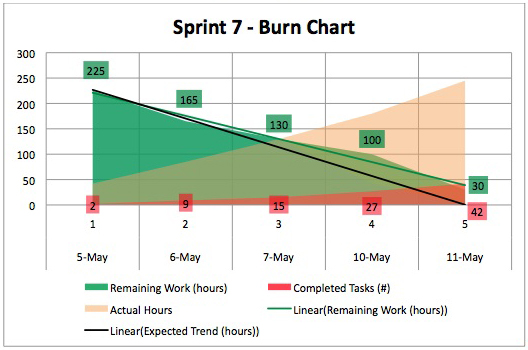

### When can Product Backlog Refinement occur?
- [ ] Only during Sprint Planning.
- [x] Anytime during the Sprint.
- [ ] Only during Refinement meetings planned by the Product Owner.
- [ ] Before Sprint Planning.
### Who creates documentation included with an Increment?
- [x] The Developers.
- [ ] Increments do not need documentation.
- [ ] The Product Owner.
- [ ] Technical Writers.
- [ ] The Scrum Master.
### Which three of the following are feedback loops in Scrum?
- [x] Daily Scrum.
- [ ] Release Planning.
- [x] Sprint Review.
- [ ] Refinement Meeting.
- [x] Sprint Retrospective.
### When do the Developers show their work to the Product Owner?
- [ ] Whenever the Product Owner asks.
- [ ] During the Sprint Review.
- [ ] Anytime the Developers need feedback from the Product Owner.
- [x] All of the above.
### Who determines how work is performed during the Sprint?
- [ ] The Scrum Master.
- [ ] The Scrum Team.
- [ ] Team Manager.
- [ ] Subject matter experts.
- [x] The Developers.
### Who creates tests on a Scrum Team?
- [ ] The Product Owner.
- [x] The Developers.
- [ ] Quality Assurance Specialists.
- [ ] The Scrum Master.
### While developing new functionality, you find a bug that has already been delivered to the customer. What do you do?
- [ ] Revise the tests so that the bug no longer appears on the bug report.
- [ ] Fix the bug.
- [x] Talk to the Product Owner.
- [ ] Stub out the code that caused the bug so it no longer occurs.
### Who has the final decision about the order of items in the Product Backlog?
- [ ] The Scrum Master.
- [ ] The Stakeholders.
- [ ] The Scrum Team.
- [ ] The Developers.
- [x] The Product Owner.
### How much time must a Product Owner spend with the Developers?
- [ ] 100%.
- [ ] Enough so that the Product Owner is not surprised by the value delivered by the Increment.
- [ ] 40%, or more if the Stakeholders agree.
- [x] Any amount of time the Developers ask the Product Owner to be present.
### True or False: When multiple teams work together on the same Product, each team should maintain a separate Product Backlog.
- [ ] True.
- [x] False.
### What are three of the best ways to address non-functional requirements?
- [ ] Scrum is for functional, front-end development only.
- [x] Important, recurring non-functional requirements can be added to the Definition of Done.
- [ ] Discuss them during a risk mitigation phase before development.
- [x] Include them in the Product Backlog.
- [x] Specific expectations can be used as Acceptance Criteria to specific Product Backlog Items.
- [ ] Before the release, they should be tested and validated in a hardening Sprint.
### What are two ways that regulatory compliance issues are dealt with in Scrum?
- [ ] They are addressed by a separate team who is responsible for compliance issues.
- [x] They are addressed along with functional development of the Product.
- [x] They are discussed, determined, and documented before the actual feature development Sprints.
- [ ] They are added to the Product Backlog and addressed in early Sprints, while always requiring at least some business functionality. no matter how small.
### True or False: User Stories are required in the Product Backlog.
- [ ] True.
- [x] False.
### Which statements are true when multiple Scrum Teams work on a Software Product at the same time?
- [ ] All Scrum Teams work in their own version control branch.
- [ ] Code is merged at the Scrum of Scrums.
- [x] The Scrum Teams must integrate their work before the end of the Sprint.
- [x] The Scrum Teams coordinate their work to deliver a single Increment.
- [ ] Each Scrum Team should have a different Product Owner.
### In what ways do Developers contribute to refining the Product Backlog?
- [x] They ask questions in order to clarify the intent of Product Backlog Items.
- [ ] They do not. The Developers are only responsible for prioritizing technical work.
- [ ] They do not. The Scrum Master and the Product Owner are responsible for Product Backlog Refinement.
- [x] They give input on technical dependencies.
- [x] They may update estimates for Product Backlog Items.
### When should the Developers create their first automated build?
- [ ] Just before the Product is released.
- [ ] Before writing the first line of code.
- [ ] When the Product Owner asks for a build.
- [ ] Just before the end of the Sprint.
- [x] As soon as there is code in the Version Control System.
### Which of the following are quality goals in Application Architecture?
- [ ] Design Pattern selection.
- [x] Scalability.
- [ ] Build.
- [x] Security.
### How much work is required of the Developers to complete a Product Backlog Item selected during the Sprint Planning?
- [ ] A proportional amount of time on analysis, design, development, and testing.
- [ ] All development work and at least some testing.
- [ ] As much as they can fit into the Sprint, with remaining work deferred to the next Sprint.
- [x] As much as s required to meet the Scrum Team's Definition of Done.
### Why might Developers choose to do Pair Programming?
- [ ] Information sharing and learning.
- [ ] Improving Code Quality.
- [ ] Efficiency.
- [ ] It can be a fun way to work.
- [x] All of the above.
### What tactic should a Scrum Master use to divide a group of 100 people into multiple Scrum Teams?
- [ ] Create teams based on their skills across multiple layers (such as database, Ul, etc.).
- [x] Ask the people to divide themselves info teams.
- [ ] Ask the Product Owner to assign the people to teams.
### Developers are blocked by an impediment in the middle of the Sprint. The impediment is outside the Developer's control. What should they do?
- [ ] Stop using Scrum until the impediment is resolved.
- [ ] Complete the work that can be done and complete the remainder during the hardening Sprint.
- [x] Immediately raise the issue to the Scrum Master.
- [ ] Cancel the Sprint.
- [ ] Drop the Product Backlog Items affected by the impediment from the Sprint Plan.
### Which of the following is true about the Definition of Done?
- [x] It might be a subject of discussion during Sprint Retrospective.
- [ ] It is the sole responsibility of the Developers to define it.
- [ ] It is synonymous with Acceptance Criteria.
- [ ] It can only be extended; nothing can be removed.
- [x] It defines a state when the entire Increment is releasable.
### At Sprint Planning, the Scrum Team has NO clear standard to meet for releasable Software. What should the Scrum Team do?
- [ ] Ask the Product Owner to specify a Definition of Done.
- [ ] Create a unique completion checklist for each item in the Sprint.
- [x] Specify a shared Definition of Done.
- [ ] Ask the Scrum Master what they should do.
### Based on "Sprint 7 Burndown Chart" would you do anything different in Sprint 8?

- [ ] The Scrum Master adds additional Developers for Sprint 8.
- [ ] The Developers carry over incomplete Sprint Backlog items from Sprint 7 to Sprint 8 and monitor the Sprint 8 burn-down chart. As soon as deviation from trends is detected, the Developers work with the Product Owner to negotiate remaining work.
- [ ] There is nothing wrong The Developers will present all Product Backlog Items selected for Sprint 7 at the end of the Sprint.
- [x] The Developers may forecast less overall work in Sprint 8.
- [ ] Stakeholders will encourage the Scrum Team to estimate better during the Sprint 8 Planning Meeting.
- [x] The Developers put incomplete Product Backlog Items back into the Product Backlog for re-ordering.
- [ ] The Product Owner may ask the Developers to complete the unfinished Product Backlog Items from Sprint 7 in Sprint 8.
### The Daily Scrum event happens every day. What would be three concerns if the frequency were to be lowered to every two to three days?
- [x] Opportunities to inspect and adapt in the Sprint Backlog are lost.
- [ ] The Scrum Master loses the ability to update the Gantt Chart properly.
- [ ] Too much work is spent updating the Scrum Board before meeting.
- [x] Sprint Plan may become inaccurate.
- [x] Impediments are raised and resolved more slowly.
- [ ] The Product Owner cannot accurately report to the Stakeholders.
### Which of the following are required by Scrum? (choose all of those who apply)
- [ ] Release Burnup Chart.
- [ ] Burndown Chart.
- [ ] Unit Tests.
- [ ] Critical Path Analysis.
- [ ] Refactoring.
- [ ] Build automation.
- [x] None of the above.
### Who is responsible for creation of the Definition of Done?
- [ ] The Scrum Master.
- [x] The Scrum Team.
- [ ] The Development Team.
- [ ] The Product Owner.
### Does delivering changes frequently and directly into Production help to reduce risk? (choose two)
- [x] Yes, because the changes you make are much smaller and it is easier to fix problems.
- [ ] No, because each release means a risk to break something so releasing more frequently would increase the risk.
- [ ] Yes, because frequent release encourage the Developers to automate the release process.
- [x] Yes, because you get earlier feedback and can learn faster.
- [ ] No, the only way to tackle these risks is by extensive risk management.
- [ ] No, because releasing needs extensive testing which cannot be conducted frequently.
### Which three of the following criteria are most helpful as part of a Scrum Team’s Definition of Done? (choose best three answers)
- [ ] The Product is released at the end of every Sprint.
- [x] Acceptance Tests pass.
- [x] Code Review is done.
- [ ] Regression Tests pass.
- [x] No impediments exist.
### Which two criteria are useful in deciding if something should be documented every Sprint? (choose best two answers)
- [ ] The Scrum Master requires it.
- [x] It is required by the Definition of Done.
- [x] The documentation is used to enhance and maintain the Software.
- [ ] The Software tool being used requires it.
- [ ] It has always been documented in the past.
### What factor should be considered when establishing the Sprint length?
- [x] The need of the team to learn on doing work and measuring results.
- [ ] The frequency at which team formation can be changed.
- [ ] The organization release schedule.
- [ ] The organization has mandated similar length Sprints.
### True or False: Stakeholders can be included in Product Backlog Refinement?
- [x] True.
- [ ] False.
### What are two good ways for the Development Team to make a non-functional requirements visible?
- [ ] Put them on a separate list on the Scrum board, available for all to see.
- [x] Add them to the Product Backlog and keep the Product Owner posted on the expected effort.
- [ ] Run the Integration and Regression Tests before the end of the Sprint, and capture the open work for the Sprint Backlog of the next Sprint.
- [x] Add them to the Definition of Done so the work is taken care of every Sprint.
### What activities would a Product Owner typically undertake in the phase between the end of the current Sprint and the start of the next Sprint? (choose the best answer)
- [x] There are no such activities. The next Sprint starts immediately after the current Sprint.
- [ ] Work with the Quality Assurance departments on the Increment of the current Sprint.
- [ ] Refine the Product Backlog.
- [ ] Update the project plan with Stakeholders.
### You are the Scrum Master on a newly formed Scrum Team. Which two of the following activities would probably help the team in starting up? (choose the best two answers)
- [ ] Ensure the Scrum Team members have compatible personalities.
- [ ] Introduce a bonus system for the top performers in the team.
- [x] Ensure the team understands they need a Definition of Done.
- [ ] Have the development managers for each Development Team member introduce their direct reports and go over their responsibilities on the Scrum Team.
- [x] Ask the Product Owner to discuss the Product, its vision, history, goals, and context, as well as answer questions.
### Which best describes the Product Backlog? (choose the best answer)
- [x] It contains all foreseeable tasks and requirements from which the Scrum team can develop and maintain a complete project plan.
- [ ] It is allowed to grow and change as more is learned about the Product and its customers.
- [ ] It is baselined to follow change management processes.
- [ ] It provides just enough information to enable a Scrum team to start the design phase of a Product.
### What are two responsibilities of Testers in a Development Team? (choose the best two answers)
- [ ] Verifying the work of programmers.
- [x] Scrum has no "Tester" role.
- [ ] Finding bugs.
- [x] Everyone in the Development Team is responsible for quality.
- [ ] Tracking quality metrics.
### How do you know that a Development Team is cross-functional? (choose the best answer)
- [ ] A few of the Development Team members pair program and do Test Driven Development.
- [x] Development Team has all the skills to create a potentially releasable increment by the end of every Sprint.
- [ ] Every member of the Development Team is able to perform every task.
- [ ] There are no conflicts within the Development Team.
### For the purpose of transparency, when does Scrum say a new Increment of working Software must be available? (choose the best answer)
- [ ] When the Product Owner asks to create one.
- [x] At the end of every Sprint.
- [ ] Before the release Sprint.
- [ ] Every 3 Sprints.
- [ ] After the Acceptance Testing phase.
### Which three behaviors demonstrate that a team is self-organizing? (choose the best three answers)
- [ ] The Development Team inviting external people to the Sprint Planning to ask them how to turn a Product Backlog Item into an Increment via a complete and detailed Sprint Backlog.
- [ ] The Development Team members are working within the boundaries of their functional description and nicely handing off work from analyst to Developer to Tester to integration.
- [ ] The Product Owner doesn't need to be at Sprint Retrospectives.
- [ ] Stakeholders walking in at the Daily Scrum to check progress and work with the Scrum Master to optimize the functional scope for the Sprint.
- [x] Development Team members collaboratively selecting their own work during the Sprint.
- [ ] The Scrum Master is no longer needed.
- [x] The Development Team has all the skills needed to create a releasable Increment.
- [x] The Development Team creating their own Sprint Backlog, reflecting all work that is part of the Definition of Done.
### What is the purpose of a Sprint Review? (choose the best answer)
- [ ] To take time to judge the validity of the project.
- [x] To inspect the Product Increment with the Stakeholders and collect feedback on next steps.
- [ ] To review the Scrum Team's activities and processes during the Sprint.
- [ ] To build team spirit.
### True or False: The Product Owner makes sure the team selects enough from the Product Backlog for a Sprint to satisfy the Stakeholders.
- [ ] True.
- [x] False.
### Which statement best describes the Sprint Backlog as outcome of the Sprint Planning? (choose the best answer)
- [x] It is the Development Team's plan for the Sprint.
- [ ] Every item has a designated owner.
- [ ] It is a complete list of all work to be done in a Sprint.
- [ ] Each task is estimated in hours.
- [ ] It is ordered by the Product Owner.
### A Development Team selects a set of Product Backlog Items for a Sprint Backlog with the intent to get the selected items "Done" by the end of the Sprint. Which three phrases best describe the purpose of a Definition of Done? (choose the best three answers)
- [ ] It provides a template for elements that need to be included in the technical documentation.
- [x] It guides the Development Team in creating a forecast at the Sprint Planning.
- [ ] It controls whether the Developers have performed their tasks.
- [x] It creates transparency over the work inspected at the Sprint Review.
- [x] It defines what it takes for an Increment to be ready for release.
- [ ] It tracks the percentage complete of a Product Backlog Item.
### Which output from Sprint Planning provides the Development Team with a target and overarching direction for the Sprint? (choose the best answer)
- [x] The Sprint Goal.
- [ ] Sprint Review minutes.
- [ ] The Release Plan.
- [ ] The Sprint Backlog.
### The Product Owner determines how many Product Backlog Items the Development Team selects for a Sprint. (choose the best answer)
- [ ] True, but only after confirmation by the resource manager that the Team has enough capacity.
- [ ] False, capacity and commitment are the Project Manager's responsibility.
- [ ] False, the Scrum Master does that.
- [ ] True.
- [ ] True, accordingly to what was committed to the Stakeholders.
- [x] False.
### Who owns the Sprint Backlog? (choose the best answer)
- [ ] The Scrum Team.
- [ ] The Scrum Master.
- [x] The Development Team.
- [ ] The Product Owner.
### When is implementation of a Product Backlog Item considered complete? (choose the best answer)
- [x] When the item has no work remaining in order to be potentially released.
- [ ] When Quality Assurance reports that the item passes all Acceptance Criteria.
- [ ] At the end of the Sprint.
- [ ] When all work in the Sprint Backlog related to the item is finished.
### Which two of the following are true about the Scrum Master role? (choose the best two answers)
- [x] The Scrum Master teaches the Development Team to keep the Scrum meetings to their time-box.
- [ ] The Scrum Master is responsible for updating the Sprint Burndown.
- [ ] The Scrum Master assigns tasks to Development Team members when they need work.
- [x] The Scrum Master helps those outside the team interact with the Scrum Team.
- [ ] At the Sprint Review, the Scrum Master identifies what has been "Done" and what has not been "Done".
### Which two of the following are appropriate topics for discussion during a Sprint Retrospective? (choose the best two answers)
- [ ] Documenting Acceptance Criteria for items in the next Sprint.
- [ ] The order of items in the Product Backlog.
- [x] Identifying high priority process improvements for the next Sprint.
- [x] How the team collaborates.
### True or False: Multiple Scrum Teams working on the same project must have the same Sprint start date.
- [ ] True.
- [x] False.
### When is it most appropriate for a Development Team to change the Definition of Done? (choose the best answer)
- [ ] During Sprint Planning.
- [ ] Prior to starting a new project.
- [ ] Prior to starting a new Sprint.
- [x] During the Sprint Retrospective.
### The Product Owner is not collaborating with the Development Team during the Sprint. What are two valuable actions for a Scrum Master to take? (choose the best two answers)
- [ ] Nominate a proxy Product Owner.
- [x] Coach the Product Owner in the values of Scrum and incremental delivery.
- [ ] Stop the Sprint, send the Product Owner to a course and restart.
- [ ] Inform the Product Owner's functional manager.
- [x] Bring up the problem in the Sprint Retrospective.
### A Scrum Master is working with a Development Team that has members in different physical locations. The Development Team meets in a variety of meeting rooms and has much to do logistically (for example, set up conference calls) before the Daily Scrum. What action should the Scrum Master take? (choose the best answer)
- [ ] Ask the Development Team members to alternate who is responsible for meeting setup.
- [ ] Set up the meeting and tell the Development Team that is how it will be done.
- [ ] Inform Management and ask them to solve it.
- [x] Allow the Development Team to self-manage and determine for itself what to do.
### Five new Scrum Teams have been created to build one Product. A few of the Developers on one of the Development Teams ask the Scrum Master how to coordinate their work with the other teams. What should the Scrum Master do?
- [ ] Teach the Product Owner to work with the Lead Developers on ordering Product Backlog in a way to avoid too much technical and development overlap during a Sprint.
- [ ] Collect the Sprint tasks from the teams at the end of their Sprint Planning and merge that into a consolidated plan for the entire Sprint.
- [x] Teach them that it is their responsibility to work with the other teams to create an integrated Increment.
- [ ] Visit the five teams each day to inspect that their Sprint Backlogs are aligned.
### True or False: Scrum is a methodology that tells in detail how to build Software incrementally.
- [ ] True.
- [x] False.
### In the Sprint Planning meeting, the Product Owner and the Development Team were unable to reach a clear understanding about the highest order Product Backlog Items. Because of this, the Development Team couldn't figure out how many Product Backlog Items it could forecast for the upcoming Sprint. They were able to agree on a Sprint Goal, however. Which of the following two actions should the Scrum Master support? (choose the best two answers)
- [ ] Ask everyone to take as much time as needed to analyze the Product Backlog first, and then reconvene another Sprint Planning meeting.
- [ ] Cancel the Sprint. Send the entire team to an advanced Scrum training and then start a new Sprint.
- [x] Forecast the most likely Product Backlog Items to meet the goal and create a Sprint Backlog based on a likely initial design and plan. Once the time-box for the Sprint Planning meeting is over, start the Sprint and continue to analyze, decompose, and create additional functionality during the Sprint.
- [ ] Continue the Sprint Planning meeting past its time-box until an adequate number of Product Backlog Items are well enough understood for the Development Team to make a complete forecast. Then start the Sprint.
- [x] Discuss in the upcoming Sprint Retrospective why this happened and what changes will make it less likely to recur.
### A member of the Development Team takes the Scrum Master aside to express his concerns about data security issues. What should the Scrum Master do? (choose the best answer)
- [ ] Create a Product Backlog Item for security.
- [x] Ask the person to share the issue with the team as soon as possible.
- [ ] Add security to the Definition of Done.
- [ ] Tell the Product Owner to stop further development of features until the issues are fixed.
- [ ] Go check with the Testers.
### What are three ways Scrum promotes self-organization? (choose three)
- [ ] By preventing Stakeholders from entering the development room.
- [x] By removing titles for Development Team members.
- [ ] By not allowing documentation.
- [x] By being a lightweight framework.
- [x] By the Development Team deciding what work to do in a Sprint.
### True or False: Cross-functional teams are optimized to work on one technical layer of a system only (e.g. GUI, database, middle tier, interfaces).
- [x] False.
- [ ] True.
### What are three benefits of self-organization? (choose three)
- [ ] Increased accuracy of estimates.
- [ ] Increased rule compliance.
- [x] Increased self-accountability.
- [x] Increased creativity.
- [x] Increased commitment.
### Why does a Development Team need a Sprint Goal?
- [ ] A Sprint Goal ensures that all of the Product Backlog Items selected for the Sprint are implemented.
- [x] The Development Team is more focused with a common yet specific goal.
- [ ] Sprint Goals are not valuable. Everything is known from the Product Backlog.
- [ ] A Sprint Goal only gives purpose to Sprint 0.
### How should Product Backlog Items be chosen when multiple Scrum Teams work from the same Product Backlog?
- [ ] The Product Owner should provide each team with its own Product Backlog.
- [x] The Development Teams pull in work in agreement with the Product Owner.
- [ ] Each Scrum Team takes an equal numbers of items.
- [ ] The Scrum Team with the highest velocity pulls Product Backlog Items first.
- [ ] The Product Owner decides.
### What happens during Sprint 0? (choose the best answer)
- [ ] Establish base System Architecture and design, install version control and continuous integration setup.
- [x] There is no such thing as Sprint 0.
- [ ] Base System Architecture and design.
- [ ] Overall planning, base System Architecture, base design, version control and continuous integration setup.
- [ ] Requirements gathering, version control setup, and continuous integration setup.
### Product Backlog Items are refined by: (choose the best answer)
- [ ] The Developers.
- [ ] The Product Owner.
- [x] The Scrum Team.
- [ ] The Business Analyst and the Product Owner.
### When do the Developers participate in Product Backlog Refinement? (choose the best answer)
- [x] Anytime during the Sprint.
- [ ] Never. It is the sole responsibility of the Product Owner to refine the Product Backlog.
- [ ] Only during Refinement sessions planned by the Product Owner.
- [ ] As Part 1 of Sprint Planning.
### Who should be present during Product Backlog Refinement? (choose the best answer)
- [ ] The integration architects from the release department.
- [ ] Only the most senior Developers.
- [x] Anyone that the Scrum Team decides will be valuable during Refinement.
- [ ] The Stakeholders.
- [ ] The external Business Analysts that have prepared the functional details.
### True or False: Programmers and Testers should not be included in refining Product Backlog Items.
- [ ] True.
- [x] False.
### Upon what type of process control is Scrum based? (choose the best answer)
- [ ] Defined.
- [x] Empirical.
- [ ] Complex.
- [ ] Hybrid.
### When might a Sprint be abnormally cancelled? (choose the best answer)
- [x] When the Sprint Goal becomes obsolete.
- [ ] When the sales department has an important new opportunity.
- [ ] When the Developers feel that the work is too hard.
- [ ] When it becomes clear that not everything will be finished by the end of the Sprint.
### Who should know the most about the progress toward a business objective or a release, and be able to explain the alternatives most clearly? (choose the best answer)
- [ ] The Scrum Master.
- [ ] The Project Manager.
- [x] The Product Owner.
- [ ] The Developers.
### When many Scrum Teams are working on a single Product, what best describes the Definition of Done? (choose the best answer)
- [ ] Each Scrum Team defines and uses its own. The differences are discussed and reconciled during a hardening Sprint.
- [ ] The Scrum Masters from each Scrum Team define a common Definition of Done.
- [ ] Each Scrum Team uses its own, but must make their definition clear to all other teams so the differences are known.
- [x] All Scrum Teams must have a Definition of Done that makes their combined Increment valuable and useful.
### During a Sprint, a Developer determines that the Scrum Team will not be able to complete the items in their forecast. Who should be present to review and adjust the Product Backlog Items selected? (choose the best answer)
- [x] The Product Owner and the Developers.
- [ ] The Scrum Master, the Project Manager, and the Developers.
- [ ] The Product Owner and all Stakeholders.
- [ ] The Developers.
### When should the Developers on a Scrum Team be replaced? (choose the best answer)
- [ ] As needed, with no special allowance for changes in productivity.
- [ ] Never, it reduces productivity.
- [x] As needed, while taking into account a short-term reduction in productivity.
- [ ] Every Sprint to promote shared learning.
### When is a Sprint over? (choose the best answer)
- [ ] When all Product Backlog Items meet their Definition of Done.
- [x] When the timebox expires.
- [ ] When the Product Owner says it is done.
- [ ] When all the tasks are completed.
### When does the next Sprint begin? (choose the best answer)
- [ ] Immediately following the next Sprint Planning.
- [x] Immediately after the conclusion of the previous Sprint.
- [ ] When the Product Owner is ready.
- [ ] Next Monday.
### What does it mean to say that an event has a timebox? (choose the best answer)
- [ ] The event must happen at a set time.
- [x] The event can take no more than a maximum amount of time.
- [ ] The event must happen by a given time.
- [ ] The event must take at least a minimum amount of time.
### Who is required to attend the Daily Scrum? (choose the best answer)
- [ ] The Developers and Product Owner.
- [x] The Developers.
- [ ] The Developers and Scrum Master.
- [ ] The Scrum Master and Product Owner.
- [ ] The Scrum Team.
### When does a Developer become accountable for the value of a Product Backlog Item selected for the Sprint? (choose the best answer)
- [ ] Whenever a team member can accommodate more work.
- [ ] At the Sprint Planning Event.
- [ ] During the Daily Scrum.
- [x] Never. The entire Scrum Team is accountable for creating value every Sprint.
### Who is on the Scrum Team? (choose the best three answers)
- [ ] Project Manager.
- [x] Developers.
- [x] The Product Owner.
- [x] The Scrum Master.
### Which of the following are examples of a Scrum Team practicing Scrum poorly or not exhibiting traits of a self-managing Scrum Team? (choose the best three answers)
- [ ] The Developers have all the skills they need to create a valuable, useful Increment.
- [x] Stakeholders attend the Daily Scrum to check on the Scrum Team’s progress.
- [ ] The Developers create their own Sprint Backlog, reflecting all work that is required to meet the Definition of Done.
- [ ] The Developers are collaboratively selecting their own work during the Sprint.
- [x] The Developers invite external Stakeholders to the Sprint Planning to ask them how to turn a Product Backlog Item into an Increment via a complete and detailed Sprint Backlog.
- [x] The Developers are working within the boundaries of their organizations functional description and nicely handing off work from analyst to Developer to Tester to integration.
### The timebox for the Sprint Review is: (choose the best answer)
- [ ] As long as needed.
- [ ] 2 hours.
- [x] 4 hours for a monthly Sprint. For shorter Sprints it is usually shorter.
- [ ] 4 hours and longer as needed.
- [ ] 1 day.
### The timebox for the Sprint Planning event is? (choose the best answer)
- [x] 8 hours for a monthly Sprint. For shorter Sprints it is usually shorter.
- [ ] 4 hours.
- [ ] Whenever it is done.
- [ ] Monthly.
### True or False: The purpose of a Sprint is to produce a valuable and useful Increment of working Product.
- [x] True.
- [ ] False.
### An organization has decided to adopt Scrum, but Management wants to change the terminology to fit with terminology already used. What will likely happen if this is done? (choose the best answer)
- [ ] Without a new vocabulary as a reminder of the change, very little change may actually happen.
- [ ] The organization may not understand what has changed with Scrum and the benefits of Scrum may be lost.
- [ ] Management may feel less anxious.
- [x] All of the above.
### Who creates the Definition of Done? (choose the best answer)
- [ ] The Scrum Team, in a collaborative effort where the result is the common denominator of all members' definitions.
- [ ] The Scrum Master since they are responsible for the productivity of the Developers.
- [ ] The Product Owner since they are responsible for the Product's success.
- [x] If it is not an organizational standard, the Scrum Team must create a Definition of Done appropriate for the Product.
### Who is responsible for managing the progress of work during a Sprint? (choose the best answer)
- [x] The Developers.
- [ ] The most junior member of the team.
- [ ] The Scrum Master.
- [ ] The Product Owner.
### Who has the final say on the order of the Product Backlog? (choose the best answer)
- [x] The Product Owner.
- [ ] The Stakeholders.
- [ ] The Scrum Master.
- [ ] The CEO.
- [ ] The Developers.
### Which Scrum events are timeboxed? (choose the best three answers)
- [ ] Release Retrospective.
- [x] Sprint Planning.
- [ ] Sprint Testing.
- [ ] Refinement.
- [x] Sprint Retrospective.
- [x] Sprint Review.
- [ ] Release Testing.
### A Scrum Team consists of the following: (choose the best three answers)
- [x] Product Owner.
- [x] Scrum Master.
- [ ] Customers.
- [ ] Users.
- [x] Developers.
### When does a Developer become the sole owner of a Sprint Backlog item? (choose the best answer)
- [ ] Whenever a team member can accommodate more work.
- [ ] During the Daily Scrum.
- [ ] At the Sprint Planning event.
- [x] Never. All Sprint Backlog items are "owned" by the Developers on the Scrum Team even though each item may be implemented by an individual Developer.
### What is the role of Management in Scrum? (choose the best answer)
- [x] Support the Product Owner with insights and information into high value Product and system capabilities. Support the Scrum Master to cause organizational change that fosters empiricism, self-management, bottom-up intelligence, and intelligent Product delivery.
- [ ] Continually monitor staffing levels of the Scrum Team.
- [ ] Monitor the progress of the Developers on the Scrum Team.
- [ ] Identify and remove people that are not working hard enough.
### Why is the Daily Scrum held at the same time and same place? (choose the best answer)
- [x] The consistency reduces complexity.
- [ ] The place can be named.
- [ ] The Product Owner demands it.
- [ ] Rooms are hard to book and this lets it be booked in advance.
### The length of a Sprint should be: (choose the best answer)
- [ ] Short enough to keep the business risk acceptable to the Product Owner.
- [ ] Short enough to be able to synchronize the development work with other business events.
- [ ] One month or less.
- [x] All of the above.
### How much work must the Developers complete for each Product Backlog Item they select for a Sprint? (choose the best answer)
- [x] Enough so that each Product Backlog Item they select meets the Definition of Done.
- [ ] Analysis, design, programming, testing and documentation.
- [ ] As much as it can fit into the Sprint.
- [ ] All development work and at least some testing.
### The CEO asks the Developers to add a "very important" item to a Sprint that is in progress. What should the Developers do? (choose the best answer)
- [ ] Add the item to the current Sprint and drop an item of equal size.
- [x] Inform the other members of the Scrum Team so the team can decide what to do.
- [ ] Add the item to the next Sprint.
- [ ] Add the item to the current Sprint without any adjustments.
### What is the recommended size for a Scrum Team? (choose the best answer)
- [ ] Minimum of 7.
- [ ] 9.
- [x] Typically 10 or fewer people.
- [ ] 7 plus or minus 2.
### Which statement best describes a Product Owner's responsibility? (choose the best answer)
- [ ] Keep Stakeholders from distracting the Developers.
- [x] Optimizing the value of the work the Scrum Team does.
- [ ] Managing the project and ensuring that the work meets the commitments to the Stakeholders.
- [ ] Directing the Developers.
### Who is responsible for monitoring the progress of work during a Sprint? Pick 1
- [ ] Product Owner.
- [ ] Project Manager.
- [ ] Scrum Master.
- [x] Development Team.
### Who can tell the Developers what to work on?
- [x] The Product Owner.
- [ ] The COO, CEO and CTO.
- [ ] The Project Manager.
- [ ] The Scrum Master.
### Who can do the work to ensure the Product Backlog is refined to a state that it is useful? Pick 2
- [x] The Product Owner.
- [ ] The Business Analyst.
- [ ] Stakeholders.
- [x] The Developers, with support from the Product Owner who is still accountable for it.
### SCRUM stands for:
- [ ] Super Creative Really Useful Method.
- [ ] Self organising Collaborative & Reflective Universal Method.
- [ ] Safe Controlled Response Under Management.
- [x] Nothing. Its not an acronym.
### Who manages the Sprint Backlog?
- [ ] The Scrum Master.
- [ ] The Product Owner.
- [x] The Developers.
- [ ] The Scrum Team.
### Which statement best describes a cross-functional team? Pick 1
- [ ] The team has a good mix of skills.
- [ ] All members of the team have all the skills required to create the Product.
- [x] The team has all competencies needed to accomplish the work.
### Bugs discovered out of Sprint should be:
- [ ] Investigated and fixed immediately by the Developers.
- [x] Reviewed with the Product Owner and added to the Product Backlog.
### When could a release to Production occur if a Scrum Team produced a Done increment multiple times each day? (select all that apply)
- [x] Mid Sprint.
- [x] Every Sprint.
- [x] Multiple times per day.
- [x] Every Day.
### True or False: The Definition of Done is a mandatory part of Scrum.
- [ ] False.
- [x] True.
### Who may be best positioned to decide who will be the Scrum Master for a new Scrum Team?
- [ ] The Developers.
- [ ] The Product Owner.
- [x] The Developers and the Product Owner.
- [ ] Stakeholders.
### True or False: A Scrum Team must be 10 or fewer people.
- [ ] True.
- [x] False.
### Sizing is best when: (select all that apply)
- [x] It is done by the actual Developers who will carry out the work.
- [x] It is done by a group, rather than an individual.
- [x] Estimates are made relative to similar things.
- [ ] It is done by the Lead Developer alone.
### Select the correct timebox for each Scrum event.
- [ ] Sprint Planning - 8 hours or less, Daily Scrum - 30 minutes or less, Sprint Review - 4 hours or less, Sprint Retrospective - 3 hours or less.
- [ ] Sprint Planning - 4 hours or less, Daily Scrum - 15 minutes or less, Sprint Review - 8 hours or less, Sprint Retrospective - 4 hours or less.
- [ ] Sprint Planning - 4 hours or less, Daily Scrum - 15 minutes or less, Sprint Review - 4 hours or less, Sprint Retrospective - 4 hours or less.
- [x] Sprint Planning - 8 hours or less, Daily Scrum - 15 minutes or less, Sprint Review - 4 hours or less, Sprint Retrospective - 3 hours or less.
### True or False: Planning Poker must be used by Scrum Teams.
- [x] False.
- [ ] True.
### True or False: Tasks in a Sprint Backlog must be estimated in days/hours.
- [ ] True.
- [x] False.
### Who is responsible for testing in Scrum?
- [ ] The Product Owner.
- [x] The Developers.
- [ ] Stakeholders.
- [ ] The Scrum Master.
### Which one is a Scrum Value? (pick all that apply)
- [x] Focus.
- [x] Commitment.
- [x] Courage.
- [ ] Creativity.
- [ ] Accountability.
### What does cross-functionality mean in a Scrum Team?
- [ ] Each Developer who has a special skill and works with all Scrum Teams of the organization is cross-functional.
- [ ] The Development Team should collaborate with all other functional departments of the organization.
- [x] The Development Team should have all required skills to create potentially releasable Increments without any dependency to others outside the team.
- [ ] Each Development Team member should have all required skills to create potentially releasable Increments without any dependency to others outside the team.
### What is the proper reaction of the Development Team in the middle of the Sprint when they found they have over committed?
- [ ] They should ask the Product Owner to cancel the Sprint.
- [ ] They extend the Sprint duration.
- [ ] They can add new team members to the team.
- [x] They negotiate with the Product Owner about the scope of the Sprint Backlog Items.
### What is the Sprint Planning time-box for two-week Sprints?
- [ ] Usually 2 hours.
- [ ] Usually 8 hours.
- [ ] Usually 6 hours.
- [x] Usually 4 hours.
### Which one is true?
- [ ] There is no assignment for both Sprint Backlog elements.
- [x] The team can assign a task to a Team member with consensus.
- [ ] The team should assign both Sprint Backlog elements.
- [ ] The team assigns a Sprint Backlog Item to a Team member.
### Who is responsible for writing tests in a Scrum Team?
- [x] The Development Team.
- [ ] The programmer.
- [ ] The QA specialist.
- [ ] The Tester.
### Who are the participants of the Daily Scrum?
- [ ] The Development Team and the Scrum Master.
- [ ] The Development Team and the Product Owner.
- [ ] The Scrum Team.
- [x] The Development Team.
### Who is responsible for the documentation?
- [x] Development Team.
- [ ] Tech Lead.
- [ ] Document Writer.
- [ ] Scrum Master.
### Which concerns are most important in the scaled Scrum? Pick 2
- [x] Minimizing or removing dependencies between teams.
- [x] Creating an integrated releasable Increment at the end of each Sprint.
- [ ] Having same Sprint duration for all teams.
- [ ] Increasing all team members utilization.
### How much time does the Product Owner should consume for the Product Backlog Refinement?
- [ ] No more than 10%.
- [ ] No more than 20%.
- [ ] It is not the Product Owner responsibility.
- [x] Any time that the Product Owner needs.
### Which one is a Scrum Team role? (pick all that apply)
- [x] The Product Owner.
- [ ] The Project Manager.
- [x] The Scrum Master.
- [x] The Development Team.
### When the Product Owner can see the Development Team work?
- [ ] Just at the Sprint Review.
- [ ] Whenever the Development Team is ready.
- [x] Anytime the Product Owner asks.
- [ ] When the Tech Lead allows the Development Team to show their work.
### What are the most important things for increasing transparency?
- [ ] Using chat tools to have the best communication.
- [x] Having a Definition of Done.
- [x] Having a common language.
- [ ] Having a comprehensive documentation.
### What kind of activity can be done in the Product Backlog Refinement?
- [ ] Adding detail to the items.
- [x] Ordering.
- [x] Design.
- [ ] Develop.
### What is the recommended size of the Development Team?
- [ ] 7 ± 2.
- [ ] 5 ± 4.
- [x] 6 ± 3.
- [ ] 9 ± 3.
### What are the duties of the Development Team in a Scrum Team?
- [ ] Removing impediments.
- [x] Making technical decisions.
- [x] Resolving team internal conflicts.
- [ ] Assigning value to the Product Backlog Items.
### Which one is true about the scaled Scrum? Pick 2
- [ ] The scaled Scrum does not add or change anything in Scrum framework.
- [x] It is based on the Scrum framework.
- [x] It uses Scrum parts as its building blocks.
- [ ] Through scaled Scrum Teams work on multiple Products.
### Which factors should be considered to determine the Sprint length? (pick all that apply)
- [x] Market change speed.
- [x] Raising complexity speed.
- [x] Amount of the risk.
- [x] Cost of risk.
### Which work can be done between two Sprints?
- [x] Nothing. There is no special time between two Sprints.
- [ ] Resolving some important bugs.
- [ ] Preparing Product Backlog Items for the next Sprint.
- [ ] Thinking about architectural concerns of the next Sprint.
### How often does the Sprint Planning should be conducted?
- [ ] Once a Release.
- [ ] Each time that the Product Owner decides.
- [ ] In the middle of each Sprint.
- [x] Once a Sprint.
### True or False: Creating a done and potentially releasable Increment is the purpose of each Sprint.
- [ ] False.
- [x] True.
### Who are responsible for monitoring the progress over the Project and Sprint?
- [x] Project Progress: the Product Owner, Sprint Progress: the Development Team.
- [ ] Project Progress: the Scrum Master, Sprint Progress: the Development Team.
- [ ] Project Progress: the Development Team, Sprint Progress: the Product Owner.
- [ ] Project Progress: the Product Owner, Sprint Progress: the Scrum Master.
### What are the outputs of the Sprint Planning?
- [ ] The Increment.
- [ ] The Release Plan.
- [x] The Sprint Backlog.
- [x] The Sprint Goal.
### What will happen for the undone Sprint Backlog Items at the end of the Sprint?
- [ ] Extend the Sprint to finish them.
- [ ] Move back to the bottom of the Product Backlog.
- [x] Re-estimate and move back to the Product Backlog.
- [ ] Directly move to the next Sprint.
### What does the Development Team should do when the CEO assign them an unplanned work in the middle of the Sprint?
- [ ] Inform the Scrum Master to work with his/her.
- [ ] Reject it because they are independent.
- [ ] Accept it because the CEO is the highest rank in the organization.
- [x] Inform the Product Owner to work with his/her.
### When the Development Team can change their practices, tools or techniques?
- [x] Whenever needed.
- [ ] At the end of each release.
- [ ] At the beginning of the project.
- [ ] At the end of each Sprint.
### How many Definition of Done should be used in scaled Scrum?
- [ ] They can have a separate Definition of Done for each team as long as they do not violate each other.
- [ ] Each team should have a separated Definition of Done.
- [x] All teams should have one Definition of Done.
- [x] All teams can have one common Definition of Done as long as they can create a unique integrated Increment.
### Who creates the Sprint Backlog?
- [ ] The Scrum Master.
- [ ] The Product Owner.
- [ ] The Scrum Team.
- [x] The Development Team.
### When is a feature done?
- [x] When it is potentially releasable and shippable.
- [ ] When the Product Owner approves it.
- [ ] When the customer accepts it.
- [ ] When the Scrum Master approves it.
### True or False: The Development Team has immediately resolved a bug, which is found in the current Sprint and belongs to an Increment that has already been delivered to the market. Is it a proper behavior?
- [x] False.
- [ ] True.
### What is the usual comparison of Product Backlog Items average size in the Product Backlog and Sprint Backlog?
- [ ] Product Backlog Items in the Product Backlog are usually smaller than the Sprint Backlog.
- [ ] Product Backlog Items in the Product Backlog are usually larger than the Sprint Backlog.
- [ ] Product Backlog Items usually have the same size in both the Product Backlog and the Sprint Backlog.
- [x] Such a comparison does not make sense.
### Which is true about the Sprint Backlog?
- [ ] It is a list of selected Product Backlog Items that the Development Team has committed for the Sprint.
- [ ] It contains all Product Backlog Items and requirements that could be implemented for the project.
- [ ] It is created one Sprint ahead the current Sprint.
- [x] It is a plan for the Development Team to realize the Sprint Goal.
### Which one is true about Definition of Done and Acceptance Criteria? (pick all that apply)
- [ ] Acceptance Criteria should be passed for a feature in order to be called as complete and done.
- [x] Acceptance Criteria should be passed to ensure that a feature is working as expected.
- [x] Definition of Done should be applied to a feature in order to be called as complete.
- [x] There are many Acceptance Criteria in a Product.
- [ ] There are many Definition of Done in a Product and a Scrum Team.
### True or False: In an impediment case, the Scrum Master can intervene to help the Development Team to remove a member from the Development Team.
- [ ] False.
- [x] True.
### Which one is true about the Daily Scrum? Pick 3
- [x] It is a feedback loop.
- [ ] All Scrum Team members should participate in it.
- [x] The Development Team monitors Sprint progress toward the Sprint Goal.
- [x] It is a 15 minutes time-box event.
### What are traits of a high performance Scrum Team? (pick all that apply)
- [x] They live the Scrum Values deeply.
- [x] They help their customers become more successful.
- [x] They evolve the Definition of Done over time and add more stringent criteria to it continuously.
- [x] There is a high level of creativity, productivity and accountability in the Team dynamics.
- [ ] They respect top managers through accepting their work every time.
### Who knows best about how to create usable and releasable Increments?
- [x] The Development Team.
- [ ] The Scrum Master.
- [ ] The Technical Manager.
- [ ] The Product Owner.
### Who is responsible for the Product Backlog Items and tasks estimation in Scrum?
- [ ] The Product Owner.
- [ ] The Scrum Master.
- [ ] The Project Manager.
- [x] The Development Team.
### How do the Developers divide into multiple teams in scaled Scrum?
- [ ] The top Management divides them.
- [x] The Developers divide themselves.
- [ ] The Product Owner divides them.
- [ ] The Scrum Master divides them.
### What should the Development Team do when there is no standard contract to create a releasable Product?
- [ ] Ask the Product Owner to make a Definition of Done.
- [ ] Ask Project Manager to help them.
- [ ] Define a list of satisfactory tests for each PBI.
- [x] The Development Team should define a Definition of Done.
### True or False: Through the Sprint Review, the Scrum Team tries to hand-off the Increment to the Customer formally.
- [x] False.
- [ ] True.
### Which Scrum Values are adhered by not building Product Backlog Items that have low business value? Pick 3
- [x] Courage.
- [x] Respect.
- [x] Focus.
- [ ] Transparency.
- [ ] Adaptation.
### Which Scrum events can use more time rather than their time-box if there are 9 Developers (the maximum Development Team size) in the Team?
- [ ] The Daily Scrum.
- [ ] The Sprint Retrospective.
- [x] No one.
- [ ] The Sprint Review.
### Product Backlog Items are refined by:
- [ ] The Business Analyst and the Product Owner.
- [ ] The Development Team.
- [x] The Development Team and the Product Owner.
- [ ] The Product Owner solely.
### Should User Stories be part of the documentation generated by a Scrum project?
- [ ] Always.
- [ ] If the Architect requires it.
- [x] If they are part of the Definition of Done.
- [ ] Never.
- [ ] They must be provided to the Development Team as part of the user specifications documents.
### The Definition of Done describes the work that must be completed for every Product Backlog Item before it can be deemed releasable. What should the Development Team do when, during the Sprint, it finds out that a problem outside of their control blocks them from doing all this work?
- [ ] Cancel the Sprint.
- [ ] Complete the work that can be done on as much scope as possible and complete the rest during the "hardening" Sprints at the end of the release.
- [ ] Complete the work that can be done on as much scope as possible and use the Sprint Review to plan the rest with the Stakeholders.
- [x] Immediately raise the issue to the Scrum Master as an impediment.
- [ ] Stop using Scrum.
### To refine Product Backlog Items, the following activities will occur implicitly or explicitly: (choose all that apply)
- [x] Analysis.
- [x] Decomposition.
- [x] Design.
- [ ] Programming.
- [ ] Testing.
### True or False: Only technical writers can create documentation during a Sprint.
- [ ] True.
- [x] False.
### True or False: The Scrum Team should choose at least one high priority process improvement, identified during the Sprint Retrospective, and place it in the Product Backlog.
- [ ] True.
- [x] False.
### When does the Development Team participate in Product Backlog Refinement?
- [x] Anytime during the Sprint.
- [ ] As Part 1 of the Sprint Planning meeting.
- [ ] Never. It is the sole responsibility of the Product Owner to refine the Product Backlog.
- [ ] Only during Refinement meetings planned by the Product Owner.
### Who must be present at the Daily Scrum meeting?
- [ ] Anyone who wants to attend.
- [ ] No one is required, anyone who wishes to attend is welcome.
- [x] The Development Team.
- [ ] The entire Scrum Team.
- [ ] The Scrum Master and the Development Team.
### Who should be present during Product Backlog Refinement? (choose all that apply)
- [ ] Only the most senior people from the Development Team.
- [x] The Development Team.
- [ ] The external Business Analysts that have prepared the functional details.
- [ ] The integration architects from the release department.
- [x] The Product Owner.
- [ ] The Stakeholders.
### For which of the following is the Scrum master responsible? (choose the best answer)
- [x] Properly adopting and using the scrum framework.
- [ ] The meetings and
- [ ] They eliminate the need for Build Engineers.
- [ ] They ensure your Product remains bug free.
- [ ] They support continuous integration.
### For which of the following is the Scrum Master responsible? (choose the best answer)
- [x] Properly adopting and using the Scrum framework.
- [ ] The meetings and the objectives that a Scrum Team sets for itself.
- [ ] Managing the performance of the Scrum Team.
- [ ] Keeping track of resource allocation.
### True or False: A Scrum Master fulfills the same role as a traditional Project Manager.
- [ ] True
- [x] False
### Who is responsible for engaging stakeholders? (choose the best answer)
- [ ] The Business Analyst.
- [ ] The Developers.
- [ ] The Project Manager.
- [ ] The Team Manager.
- [x] The Scrum Team.
### How often should Scrum Team membership change? (choose the best answer)
- [ ] Every Sprint to promote shared learning.
- [ ] As needed, with no special allowance for changes in productivity.
- [ ] Never, it reduces productivity.
- [x] As needed, while taking into account a short-term reduction in productivity.
### What enhances the transparency of an Increment? (choose the best answer)
- [ ] Updating Sprint tasks properly in the electronic tracking tool.
- [x] Doing all work needed to meet the Definition of Done.
- [ ] Reporting Sprint progress to the stakeholders daily.
- [ ] Keeping track of and estimating all undone work to be completed in a "hardening" Sprint.
### Which three behaviors demonstrate that a Scrum Team is self-managing? (choose the best three answers)
- [x] The Scrum Team has all the skills needed to create an Increment.
- [x] Developers collaboratively selecting their own work during the Sprint.
- [x] The Developers create their own Sprint Backlog, reflecting all work that is part of the Definition of Done.
- [ ] The Scrum Team members are working within the boundaries of their functional description and nicely handing off work from analyst to developer to tester to integration.
- [ ] The Scrum Master is no longer needed.
- [ ] Stakeholders are attending the Daily Scrum to check progress and work with the Scrum Master to optimize the functional scope for the Sprint.
### Which of the following are topics for the Developers to discuss at the Daily Scrum as they inspect their progress toward the Sprint Goal? (choose the best three answers)
- [x] What have we learned since yesterday, and how should we modify our plan to increase our ability to meet the Sprint Goal?
- [x] Are there any impediments blocking progress toward the Sprint Goal?
- [ ] What will be working on tomorrow?
- [ ] Why were you late?
- [ ] How many hours did I spend on the project yesterday?
- [x] Are there any decisions that need to be made to maintain progress toward the Sprint Goal?
- [ ] Will today's work negatively impact our ability to meet the Sprint Goal for the Sprint following this one?
### A Scrum Team is experiencing a growing list of impediments. Which techniques would be most helpful in this situation? (choose the best two answers)
- [ ] Arrange a triage meeting with management.
- [x] The Scrum Master discusses the impediments with the Scrum Team.
- [x] As a Scrum Team, prioritize the list and work on them in order.
- [ ] The Product Owner should add the open impediments to the Product Backlog.
### What is the Product Owner responsible for during the Sprint Retrospective? (choose the best answer)
- [x] Participating as a Scrum Team member.
- [ ] The Product Owner should not take part in Sprint Retrospective.
- [ ] Capturing requirements for the Product Backlog.
- [ ] Summarizing and reporting the discussions to the stakeholders that they represent in the Scrum Team.
### You are the Scrum Master of a new, to be developed Product. Development is going to require 45 people. What is a good first question for you to suggest the group thinks about when forming into teams? (choose the best answer)
- [ ] Who are the subject matter experts on each team?
- [x] How will we make sure all teams have the right amount of expertise?
- [ ] Who are going to be the team leads?
- [ ] What is the right mixture of senior and junior people on each team?
### A Scrum Team is a cohesive unit of professionals that consists of which of the following? (choose all that apply)
- [x] One Product Owner.
- [x] One Scrurh Master.
- [ ] Users.
- [ ] Customers.
- [x] Developers.
### A Sprint Retrospective should be held: (choose the best answer)
- [x] At the end of each Sprint.
- [ ] At the end of the last Sprint in a project or a release.
- [ ] At the beginning of each Sprint.
- [ ] Only when the Scrum Team determines it needs one.
### Why does the Product Owner want the Developers to adhere to its Definition of Done? (choose the best answer)
- [ ] To know what the team will deliver over the next three Sprints.
- [x] To have complete transparency into what has been done at the end of each Sprint.
- [ ] To be able to reprimand the team when they do not meet their velocity goal for the Sprint.
- [ ] To predict the team's productivity over time.
### Which of the following is a Developer accountable for? (choose the best two answers)
- [x] Organizing the work required to meet the Sprint Goal.
- [ ] Selecting the Product Owner.
- [ ] Reporting productivity.
- [x] Creating a plan for the Sprint, the Sprint Backlog.
### When is a Product Backlog item considered complete? (choose the best answer)
- [ ] When the item passes all acceptance criteria.
- [ ] When the item has gained product sponsor approval.
- [ ] At the end of the Sprint.
- [x] When the item meets the Definition of Done.
### True or False: Cross-functional teams are optimized to work on one component or layer of a system only.
- [ ] True
- [x] False
### Why is the Daily Scrum held at the same time and same place? (choose the best answer)
- [ ] Rooms are hard to book and must be booked in advance.
- [ ] The Product Owner demands it.
- [x] The consistency reduces complexity.
- [ ] The place can be named.
### What may be included in the Sprint Backlog? (choose the best answer)
- [ ] User Stories.
- [ ] Tasks.
- [ ] Use Cases.
- [ ] Tests.
- [x] Any of the above (or others) which are a decomposition of the selected Product Backlog items.
### Which two of the following are true about the Scrum Master? (choose the best two answers)
- [x] The Scrum Master teaches the Scrum Team to use timeboxes.
- [ ] The Scrum Master assigns tasks to Developers when they need work.
- [x] The Scrum Master helps those outside the team interact with the Scrum Team.
- [ ] At the Sprint Review, the Scrum Master identifies what work is done and not done.
- [ ] The Scrum Master is responsible for updating the Sprint Burndown.
### At the end of a Sprint, a Product Backlog item worked on during the Sprint does not meet the Definition of Done. What two things should happen with the undone Product Backlog item? (choose the best two answers)
- [ ] If the stakeholders agree, the Product Owner can accept it and release it to the users.
- [x] Put it on the Product Backlog for the Product Owner to decide what to do with it.
- [x] Do not include the item in the Increment this Sprint.
- [ ] Review the item, add the done part of the estimate to the velocity and create a Story for the remaining work.
### True or False: Developers do not meet with stakeholders; only the Product Owner meets with stakeholders.
- [ ] True
- [x] False
### True or False: Developers do not meet with stakeholders; only the Product Owner meets with stakeholders.
- [ ] True
- [x] False
### When must a Scrum Team release each Increment? (choose the best answer)
- [ ] After every Sprint, without exception.
- [ ] When the Scrum Team finishes their work.
- [x] When it makes sense to release it.
- [ ] Whenever the product is free of defects.
### If burndown charts are used to visualize progress, what do they track? (choose the best answer)
- [x] Work remaining across time.
- [ ] Individual worker productivity.
- [ ] Accumulated business value delivered to the customer.
- [ ] Accumulated cost.
### What is the timebox for the Sprint Planning event? (choose the best answer)
- [ ] 4 hours for a one-month Sprint.
- [ ] Monthly.
- [x] 8 hours for a one-month Sprint.
- [ ] Whenever it is done.
### Which statement best describes a Product Owner's responsibility? (choose the best answer)
- [ ] Keep stakeholders from distracting the Developers.
- [x] Optimizing the value of the work the Scrum Team does.
- [ ] Ensuring that the work meets the commitments to the stakeholders.
- [ ] Directing the Developers.
### True or False: Scrum has a role called "Project Manager".
- [ ] True
- [x] False
### Who is part of the discussion about which Product Backlog items are selected for a Sprint? (choose the best answer)
- [ ] The Scrum Master.
- [ ] The Developers.
- [x] The Scrum Team.
- [ ] The Product Owner
### When the Developers determine that they will not be able to finish the complete forecast, who has to be present when reviewing and adjusting the Sprint work selected? (choose the best answer)
- [ ] The Product Owner and all stakeholders.
- [ ] The Scrum Master and the Developers.
- [ ] The Scrum Master, project manager and the Developers
- [x] The Product Owner and the Developers.
### Which Scrum Value is affected by a lack of trust in the Scrum Team? (choose the best answer)
- [ ] Focus
- [ ] Respect
- [ ] Openness
- [ ] Courage
- [ ] Commitment
- [x] All of the above
### What is the timebox for the Sprint Review? (choose the best answer)
- [x] 4 hours for a one-month Sprint.
- [ ] 2 hours for a one-month Sprint.
- [ ] As long as needed.
- [ ] 1 day.
### True or False: To get started in terms of what to build, Scrum requires no more than a Product Owner with enough ideas for a first Sprint, Developers to implement those ideas, and a Scrum Master to help guide the process.
- [x] True
- [ ] False
### A Product Owner wants advice from the Scrum Master about estimating work in Scrum. What guidance should a Scrum Master give? (choose the best answer)
- [ ] Product Backlog items must be estimated in story points.
- [ ] Estimates are made by the Product Owner, but are best checked with the
- [ ] Developers.
- [ ] Estimates must be in relative units.
- [x] Estimates are made by the people doing the work.
- [ ] Scrum forbids estimating.
### What activities would a Product Owner typically undertake in the period between the end of the current Sprint and the start of the next Sprint? (choose the best answer)
- [ ] Update the project plan with stakeholders.
- [ ] Work with the Quality Assurance departments on the Increment of the current Sprint.
- [x] There are no such activities. The next Sprit starts immediately after the Current Sprint.
- [ ] Refine the Product Backlog.
### The length of a Sprint should be: (choose the best answer)
- [ ] Short enough to keep the business risk acceptable to the Product Owner
- [ ] Short enough to be able to synchronize the development work with other business events.
- [ ] No more than one calendar month.
- [x] All of the above.
### Who starts the Daily Scrum? (choose the best answer)
- [ ] The Scrum Master. This ensures that the Developers have the event, and it stays within the timebox.
- [ ] The person coming in last. This encourages people to be on time and helps to stay within the timebox.
- [ ] The Product Owner.
- [x] Whoever the Developers decide should start.
- [ ] The person who has the token.
### Which of the following is an example of an Increment? (choose the best answer)
- [ ] A plan for the overall product release.
- [ ] A mock-up of the product marketing materials.
- [ ] A design for the product.
- [ ] A product roll-out plan.
- [x] A valuable, useful set of product features.
- [ ] All of the above.
### Who is accountable for tracking the remaining work toward the Sprint Goal? (choose the best answer)
- [x] The Developers.
- [ ] The Product Owner.
- [ ] The Project Manager.
- [ ] The Scrum Master.
### True or False: An Increment must be released to customers or users at the end of each Sprint.
- [ ] True
- [x] False
### How should a Scrum Team deal with non-functional requirements? (choose the best answer)
- [ ] Make sure the release department understands these requirements, but it isnot the Scrum Team's responsibility.
- [ ] Manage them during the Integration Sprint prior to the Release Sprint.
- [x] Ensure every Increment meets them.
- [ ] Assign them to the lead developers on the team.
### Which two ways of creating Scrum Teams are consistent with Scrum's values? (choose the best two answers)
- [x] Existing teams propose how they would like to go about organizing into the new structure.
- [ ] The Chief Product Owner determines the new team structures and assignments.
- [x] Bring all the people together and let them organize into Scrum Teams
- [ ] Managers collaborate to assign individuals to specific teams
- [ ] Managers personally re-assign current subordinates to new teams.
### Which of the following might the Scrum Team discuss during a Sprint Retrospective? (choose the best answer)
- [ ] Methods of communication.
- [ ] The way the Scrum Team does Sprint Planning.
- [ ] Skills needed to improve the Developers abilty to deliver.
- [ ] The Definition of Done.
- [x] All of the above.
### An organization has decided to adopt Scrum, but management wants to change the terminology to fit with terminology already used. What will likely happen if this is done? (choose the best answer)
- [ ] Without a new vocabulary as a reminder of the change, very little change may actually happen.
- [ ] The organization may not understand what has changed within Scrum and the benefits of Scrum may be lost.
- [ ] Management may feel less anxious.
- [x] All answers apply.
### A Scrum Team has been working on a product for nine Sprints. A new Product Owner comes in, understanding she is accountable for the Product Backlog. However, she is unsure about her responsibilities. Which two activities are part of the Product Owner? (choose the best two answers)
- [ ] Providing the Developers with detailed specifications.
- [x] Interacting with stakeholders.
- [ ] Describing features as Use Cases.
- [x] Ensuring that the most valuable functionality is produced first, at all times.
- [ ] Creating detailed functional test cases.
### How is management that is external to the Scrum Team involved in the Daily Scrum? (choose the best answer)
- [ ] The Scrum Master speaks on their behalf.
- [x] Managers are not required at the Daily Scrum.
- [ ] Management gives an update at the start of each Daily Scrum.
- [ ] The Product Owner represents their opinions.
### A Scrum Master is working with a Scrum Team that has members in different physical locations. The Scrum Team meets in a variety of meeting rooms and has much to do logistically (for example, set up conference calls) before the Daily Scrum. What action should the Scrum Master  take? (choose the best answer)
- [ ] Set up the meeting and tell the Scrum Team that is how it will be done.
- [ ] Ask the Developers to alternate who is responsible for meeting setup.
- [x] Allow the Scrum Team to self-manage and determine for itself what to do.
- [ ] Inform management and ask them to solve it.
### What techniques could the Scrum Master use when the Scrum Team gets caught in an internal disagreement about which agile practices to apply? (choose the best two answers)
- [x] Involve the complete Scrum Team in making a decision.
- [ ] Ask team members to take the issue up with the company's Human Resources department.
- [ ] Ask an external agile coach what they recommend.
- [x] Use coaching techniques, such as open questions and active listening.
### What is the key concern when multiple Scrum Teams are working from the same Product Backlog? (choose the best answer)
- [ ] Meeting original scope projections.
- [ ] Clear definition of requirements.
- [ ] Making sure there is enough work for everyone on each team.
- [ ] Maximizing velocity.
- [x] Minimizing dependencies between teams.
### Who owns the Sprint Backlog? (choose the best answer)
- [ ] The Product Owner.
- [ ] The Scrum Master.
- [ ] The Scrum Team.
- [x] The Developers.
### What is the role of management in Scrum? (choose the best answer)
- [x] To present the Scrum Teams with insights and resources that help them improve.
- [ ] To continually monitor staffing levels of the Scrum Team.
- [ ] To monitor the productivity of the Developers.
- [ ] To identify and remove people that are not working hard enough.
### When Developers are having trouble delivering an Increment because they do not understand a functional requirement, what should they do? (choose the best answer)
- [x] Collaborate with the Product Owner to determine what is possible and acceptable.
- [ ] Defer the work to a more appropriate Sprint.
- [ ] Add a specialist to the Development Team.
- [ ] Partially complete the functionality, and discuss the remaining work at the Sprint Review.
### How much of the Sprint Backlog must be defined during the Sprint Planning event? (choose the best answer)
- [x] Enough so the Developers can create their forecast of what work they can do.
- [ ] Just enough to understand design and architectural implications.
- [ ] The entire Sprint Backlog must be identified and estimated by the end of Sprint Planning.
- [ ] Just enough tasks for the Scrum Master to be confident in the Developers understanding of the Sprint.
### What is the recommended size for a Scrum Team? (choose the best answer)
- [ ] At least 7.
- [ ] 9.
- [x] 10 or fewer.
- [ ] 7 plus or minus 3.
### Which two things are appropriate for a Scrum Master to do, if the Scrum Team does not have the tools and environment to completely finish each selected Product Backlog item? (choose the best two answers)
- [ ] Declare the Scrum Team not ready for Scrum.
- [x] Have the Scrum Team establish a Definition of Done that is actually possible to achieve given current
  circumstances.
- [ ] Refocus the current Sprint on establishing the Scrum Team's environment instead of delivering an Increment.
- [ ] Encourage the Product Owner to accept partially done Increments until the situation improves.
- [x] Coach the Scrum Team to improve its skills, tools and environment over time and adjust the Definition of Done
  accordingly.
### When is the Sprint Backlog created? (choose the best answer)
- [ ] Prior to Sprint Planning.
- [ ] During refinement.
- [ ] During the Sprint Retrospective.
- [x] During Sprint Planning.
### Which topics should be discussed in the Sprint Review? (choose the best answer)
- [ ] The Scrum process, and how it was used during the Sprint.
- [ ] Coding and engineering practices.
- [x] The product Increment.
- [ ] All of the above.
### Who creates the Definition of Done? (choose the best answer)
- [ ] The Product Owner
- [ ] The Developers
- [ ] The Scrum Master
- [x] The Scrum Team
### You are the Scrum Master for four Scrum Teams working from the same Product Backlog. Several of the developers come to you complaining that work identified for the upcoming two Sprints will require full-time commitment from a specialist who is external to the teams. What should the Scrum Master consider in this situation? (choose the best two answers)
- [ ] The desire to maintain a stable velocity.
- [ ] The need to have enough work to keep all Developers busy.
- [x] The ability of the Scrum Teams to produce integrated Increments.
- [x] The benefit of Developers figuring out a solution for themselves.
### What factor should be considered when establishing the Sprint length? (choose the best answer)
- [ ] The organization's release schedule.
- [x] The need for the team to learn based on doing work and measuring results.
- [ ] The organization has mandated similar length sprints.
- [ ] The freguency at which team formation can be changed.
### During the Sprint Retrospective a Scrum Team has identified several high priority process improvements. Which of the following statements is most accurate? (choose the best answer)
- [x] The Scrum Team may add the items to the Sprint Backlog for the next Sprint.
- [ ] The Scrum Team should decline to add a process improvement to the Sprint Backlog when things are running smoothly.
- [ ] The Scrum Master selects the most important process improvement and places it in the Sprint Backlog
- [ ] The Scrum Team should choose at least one high priority process improvement to place in the Product Backlog.
### What does it mean to say that an event has a timebox? (choose the best answer)
- [ ] The event must happen by a given time.
- [ ] The event must happen at a set time.
- [ ] The event must take at least a minimum amount of time.
- [x] The event can take no more than a maximum amount of time.
### When many Scrum Teams are working on a single product, what best describes the Definition of Done? (choose the best answer)
- [ ] The Scrum Masters from each Scrum Team define a common Definition of Done.
- [ ] Each Scrum Team uses its own, but must make their definition clear to all other teams so the differences are
  known.
- [x] All Scrum Teams must have a Definition of Done that makes their combined work potentially releasable.
- [ ] Each Scrum Team defines and uses its own. The differences are discussed and reconciled during a hardening Sprint.
### How do you know that a Scrum Team is cross-functional? (choose the best answer)
- [ ] A few of the Developers pair program and do Test Driven Development.
- [x] The Scrum Team has all the skills to create an Increment by the end of every Sprint.
- [ ] Every member of the Scrum Team is able to perform every task.
- [ ] There are no conflicts within the ScrumTeam.
### The Daily Scrum is an event that happens every day. What would be three key concerns if the frequency were to be lowered to every two or three days? (choose the best three answers)
- [x] The Sprint Backlog may become inaccurate.
- [ ] Too much work is spent updating the Scrum board before the meeting
- [ ] The Scrum Master loses the ability to update the Gantt chart properly.
- [ ] The Product Owner cannot accurately report progress to the stakeholders.
- [x] Opportunities to inspect and adapt the Sprint Backlog are lost.
- [x] Impediments are raised and resolved more slowly.
### Which of these may a Scrum Team deliver at the end of a Sprint? (choose the best answer)
- [x] A valuable, useful Increment that meets the Definition of Done.
- [ ] Failing unit tests, to identify acceptance tests for the next Sprint.
- [ ] An Increment of software with minor known bugs in it.
- [ ] A single document, if that is what management asked for.
### Who determines when it is appropriate to update the Sprint Backlog during a Sprint? (choose the best answer)
- [ ] The Project Manager.
- [ ] The Product Owner.
- [ ] The Scrum Team.
- [x] The Developers.
### True or False: The Product Owner makes sure the Developers select enough from the Product Backlog for a Sprint to satisfy the stakeholders.
- [ ] True
- [x] False
### A Developer takes the Scrum Master aside to express his concerns about data security issues. What should the Scrum Master do? (choose the best answer)
- [x] Ask the Developer to share the concern with the team as soon as possible.
- [ ] Tell the Product Owner to stop further development of features until the issues are fixed.
- [ ] Go check with the testers.
- [ ] Add security to the Definition of Done.
- [ ] Create a Product Backlog item for security.
### One of the Scrum events is the Daily Scrum. What are two intended outcomes of the Daily Scrum? (choose the best two answers)
- [ ] An updated Scrum board to make Sprint progress transparent for the stakeholders.
- [x] Identification of impediments that may prevent the Developers from achieving the Sprint Goal.
- [ ] A status report for the upper management indicating what each individual has done, will be doing, and what is
  impeding him/her.
- [x] A shared understanding of the most important work to be undertaken next to achieve the best possible progress
  toward the Sprint goal.
- [ ] An update of completed tasks and of the remaining work so the Scrum Master can plan the next day.
### When multiple Scrum Teams are working on the same product, should all of their lIncrements be integrated every Sprint? (choose the best answer)
- [ ] Yes, but only for Scrum Teams whose work has dependencies.
- [ ] No, that is far too hard and must be done in a hardening Sprint.
- [ ] No, each Scrum Team stands alone.
- [x] Yes, in order to accurately inspect what is done.
### When does a Developer become accountable for the value of a Product Backlog item selected for the Sprint? (choose the best answer)
- [x] Never. The entire Scrum Team is accountable for creating value every Sprint.
- [ ] At the Sprint Planning Event.
- [ ] Whenever a team member can accommodate more work.
- [ ] During the Daily Scrum.
### True or False: Multiple Scrum Teams working on the same product or system all select work from the same Product Backlog.
- [x] True
- [ ] False
### The timebox for a Daily Scrum is? (choose the best answer)
- [ ] The same time of day every day.
- [x] 15 minutes.
- [ ] Two minutes per person.
- [ ] 4 hours.
### When do Developers take ownership of a Sprint Backlog item? (choose the best answer)
- [x] Never. All Sprint Backlog items are "owned" by the entire Scrum Team.
- [ ] During the Daily Scrum.
- [ ] Whenever a team member can accommodate more work.
- [ ] At the Sprint Planning Event.
### Which of the following services are appropriate for a Scrum Master in regard to the Daily Scrum? (choose the best answer)
- [ ] Lead the discussions.
- [ ] Make sure that all 3 questions have been answered by each member of the team.
- [ ] Keep track of whether each Developer has a chance to speak.
- [x] Teach the Developers to keep the Daily Scrum within 15 minutes.
- [ ] All of the above.
### The Developers select a set of Product Backlog items for a Sprint Backlog with the intent to get the selected items done by the end of the Sprint. Which three phrases best describe the purpose of a Definition of Done? (choose the best three answers)
- [ ] It tracks the percentage complete of a Product Backlog item.
- [ ] It provides a template for elements that need to be included in the documentation.
- [ ] It controls whether the developers have performed their tasks.
- [x] It guides the Developers in creating a forecast at the Sprint Planning.
- [x] It defines what it takes for an Increment to be ready for release.
- [x] It creates transparency over the work inspected at the Sprint Review.
### When is a Sprint over? (choose the best answer)
- [ ] When all the tasks are completed.
- [ ] When all Product Backlog items meet their Definition of Done.
- [x] When the timebox expires.
- [ ] When the Product Owner says it is done.
### Several Sprints into a project, the Product Owner tells the Scrum Master that a key stakeholder just started using the product. The stakeholder is unhappy with the quality of the product. What are two good options for the Scrum Master? (choose the best two answers)
- [ ] Explain to the Product Owner that it is up to the Developers to decide on acceptable quality standards.
- [ ] Wait to bring this up until the Sprint Retrospective.
- [ ] Bring the concern to the testers to improve how the Product is verified.
- [x] Coach the Product Owner on how to talk with the Developers about this concern.
- [x] Encourage the Product Owner to put quality specifications on the Product Backlog and express the stakeholder's concern to the Developers.
